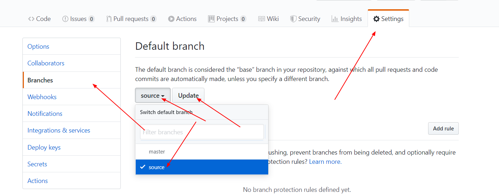

## 综述

使用hexo结合github博客需要在自己的github上建立一个和自己的github用户名相同的库，如：
**https://github.com/chuanfanyoudong/chuanfanyoudong.github.io**
但是发现在这个库的master分支只是存储了生成的html代码，没有存储原始的markdown文件，但是这样不利于我们的markdown文件的安全，把他放在github上是比较安全的，目前主要有两个方法：
* 1.新建一个其他库，用来存放markdown文件
* 2.在当前库下建立一个其他分支，存储markdown文件

在这里本着不能太罗嗦的原则，我选择了第二种方案，基本上需要下面几步：
* 1.新建一个分支source（名字可自取），用来存储markdown文件 
    
    

* 2.将**chuanfanyoudong.github.io**的默认分支有改为source
    
    

* 3.线下配置
    
    * 你需要利用git clone 把数据拉下来，注意这时候拉下来只是转好的html代码，也就是只是博客内容里面public文件夹下面的内容
    
    * 然后你把目录覆盖成博客里面的内容就好了
    
    * git add .
    * git commit -m "commit hexo markdown file"
    * git push origin source

 